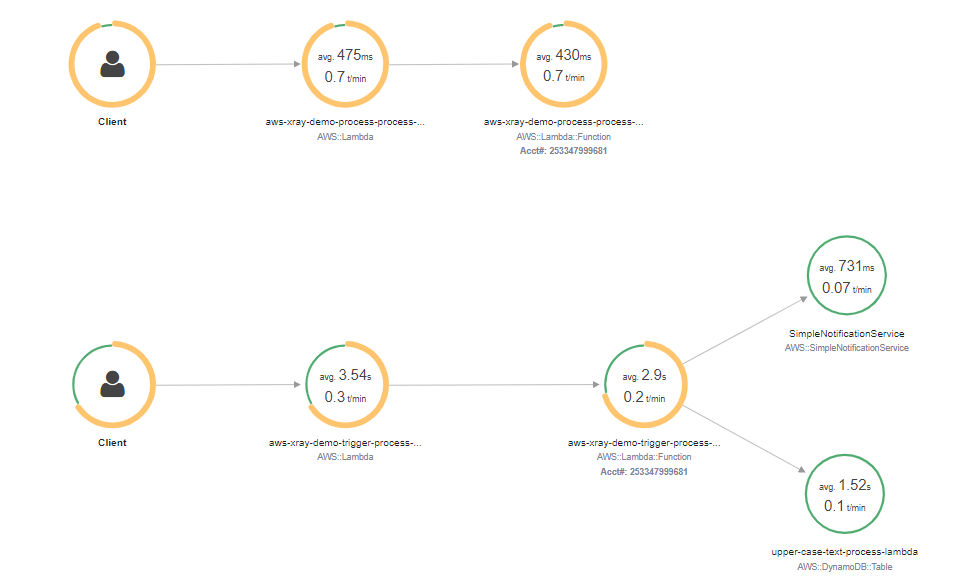
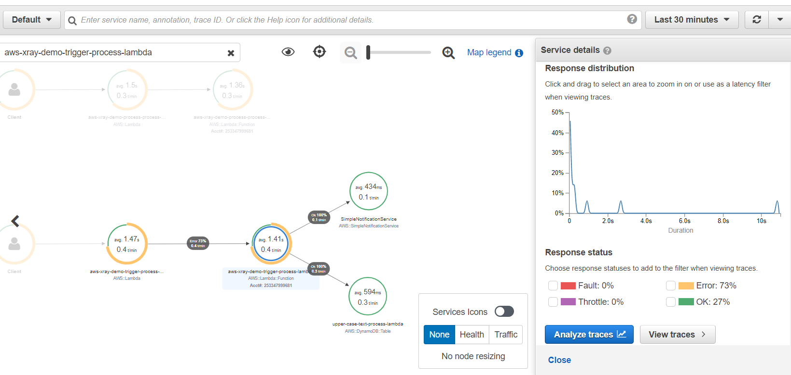
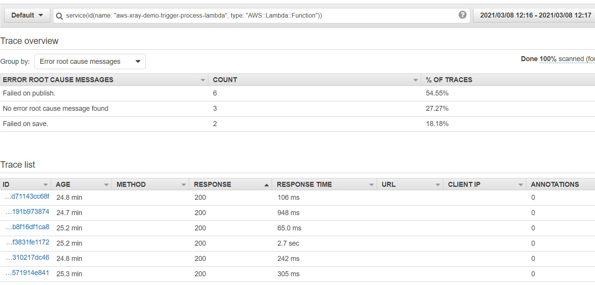
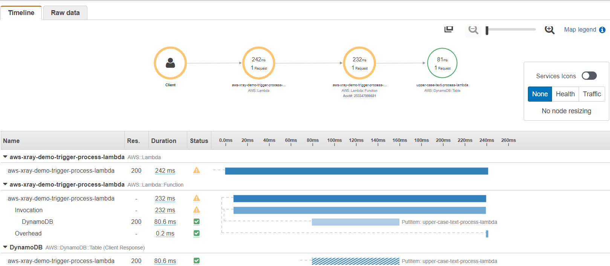
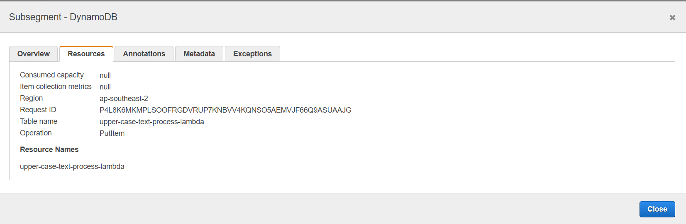
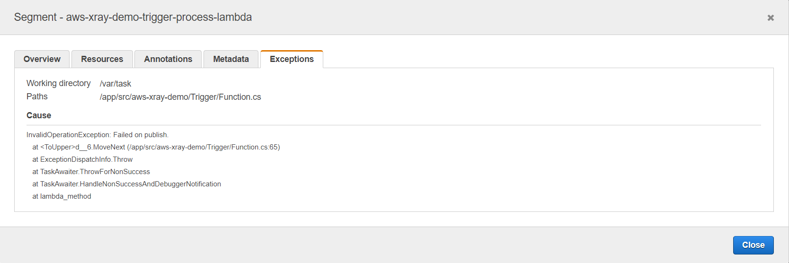

# aws-xray-demo

## What's X-Ray?
AWS X-Ray helps developers analyze and debug production, distributed applications, such as those built using a microservices architecture. With X-Ray, you can understand how your application and its underlying services are performing to identify and troubleshoot the root cause of performance issues and errors. - https://aws.amazon.com/xray/

## This project
This project demonstrates the use of aws x-ray to analyze the interaction of two Lambda functions as microservices and debug potential problems - 
* Trigger - A simple function that takes a string and does a ToUpper and saves in a database (DynamoDB), publishes an SNS message for further processing.
* Process - Consumes the message from an SQS queue, which was published by the Trigger Lambda function.

To simulate the various failure points between all the services involved, the Trigger function also calculates at random, where the failure should occur for each invocation. The failure points are - 
- On save to database (Trigger function)
- On publish of message (Trigger function)
- On process of the consumed message (Process function)

## Usage
Manually invoke the Trigger function from AWS Console with any string as input. Since the failure points are activated at random, it may need couple of clicks for all the failure conditions to be false for making the entire flow pass without any exceptions

## Service map
Below is how the service map looks after couple of invocations. The map shows the lambda, dynamodb, SNS and how it interacts. There's always two sections shown for a lambda, one is AWS::Lambda which can be used to analyze the invocation of the function and it's latency, the other is AWS::Lambda::Function which is the function itself and can be used to analyze its execution.

There's no line connecting the SNS to the Process Lambda through an SQS because at the time of this writing, it is not supported by AWS. From the AWS docs (https://docs.aws.amazon.com/xray/latest/devguide/xray-services-sqs.html)- 
> It is not currently possible to connect a trace passed into an SQS queue to the Lambda consuming it on the other end. This is because although the trace header is propagated in the SQS message, you cannot set it in the Lambda because segments in Lambda are immutable.

## Debugging
### Select the time duration and click on any service to view a summary, or dig into the trace data to narrow down the exact issue - 

### View trace data, Group by error messages

### View trace details
Below image shows the details of a particular error "Failed on publish", which is a failure while publishing the SNS message. The service map is shown only till the DynamoDB since the failure occured right after saving to the database. The details also shows the different subsegments of the trace, the timeline of execution for the lambda invocation and saving to DynamoDb.

There are more details about the resource itself, for example clicking on the DynamoDb subsegment will even show the table name and type of operation that was performed - 

### Exception details
You can view the exception details by clicking on the subsegment with error status. The below image shows the error that occured within the Lambda function for a particular trace - 

There are many more options with x-ray to make make debugging easier. For instance we can add annotations which are key-value pairs which can be used in filter expressions to search trace data. More info can be found here - 

https://github.com/aws/aws-xray-sdk-dotnet
